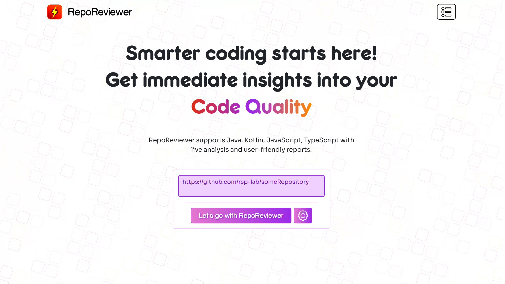
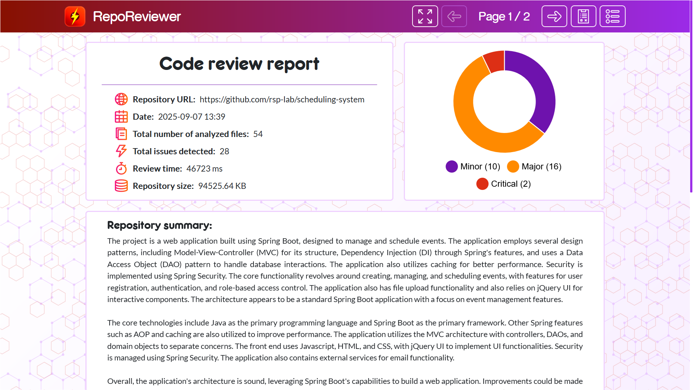
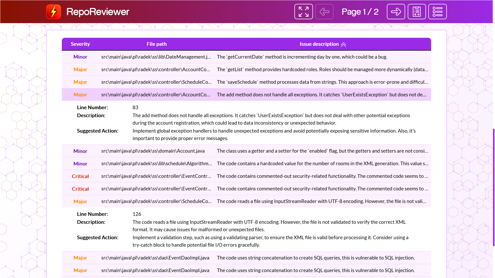
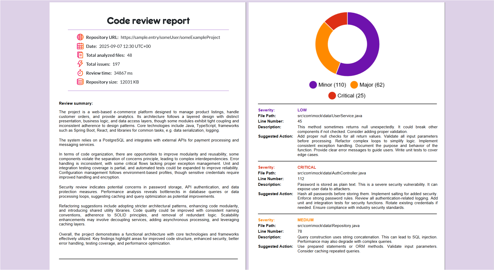

# RepoReviewer - GitHub Repositories Analysis

**RepoReviewer** is an advanced web-designed tool to perform automated and AI-driven code reviews for public GitHub repositories.
It takes a repository link, analyzes the entire codebase, provides improvement suggestions, and generates a comprehensive PDF report.
The application helps developers gain deep insights into their work and assist them in maintaining high-quality code.

## Features:
<div align="center">
    
    <p><em>RepoReviewer accepts a GitHub repository URL for analysis.</em></p>
</div>
<br>
<div align="center">
  
  <p><em>Performs full code review.</em></p>
</div>
<br>
<div align="center">
  
  <p><em>Provides detailed suggestions for code improvements.</em></p>
</div>
<br>
<div align="center">
  
  <p><em>Generates a comprehensive PDF report summarizing the review.</em></p>
</div>

### RepoReviewer:
- Leverages configurable AI models to provide intelligent, context-aware suggestions for code improvement.
- Utilizes caching for repeated reviews within short timeframes.
- Allows storing code reviews in a database, maintaining a history of past analyses.
- Offers two distinct modes:
  - _One Prompt_: Ideal for analyzing architectural decisions, class relationships, and overall system design.
  - _Prompt Per Class_: Sends one class per prompt to the AI for review. Best suited for detailed, isolated analysis of individual classes.
- Is organized into modular architecture with separate backend and frontend components.
- Is fully supported by the backend and frontend tests.

## Technology stack:

- **Backend:**
    - Java 21
    - Spring Boot 3.5
    - Spring Data (Embedded MongoDB with Flapdoodle)
    - EhCache 3
    - REST Api
- **Frontend:**
    - Angular 20
    - TypeScript
    - Bootstrap 5.3
- **AI:**
    - Google Gemini

## Installation

1. Clone the repository:
    ```bash
    git clone https://github.com/rsp-lab/RepoReviewer.git
    ```
2. Navigate to the backend directory:
    ```bash
    cd RepoReviewer
    cd backend
    ```
3. Build and run the Spring Boot application:
    ```bash
    mvn clean package
    java -jar target/RepoReviewer-1.0.jar --ai.api-key=[your google studio ai key]
    ```
4. RepoReviewer is running at http://localhost:8080.

## Usage

1. Open the application in your browser at http://localhost:8080.
2. Enter the proper URL of a public GitHub repository into the input field.
3. Submit the request to perform a code review and view improvement suggestions.
4. Download the PDF report.

Project link: https://github.com/rsp-lab/RepoReviewer